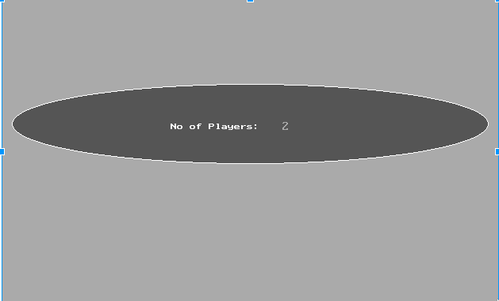
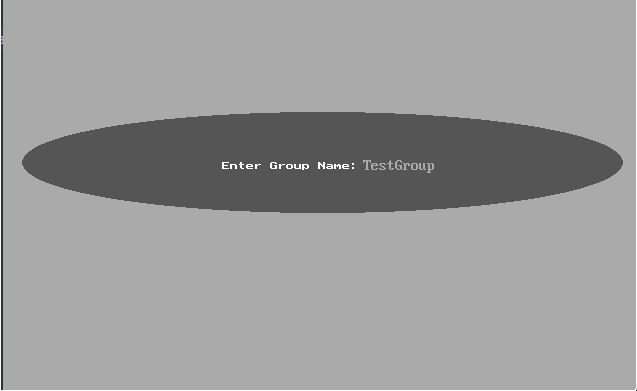
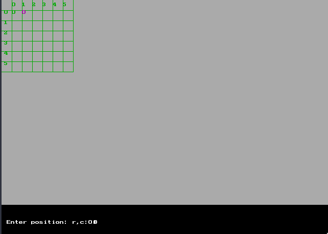
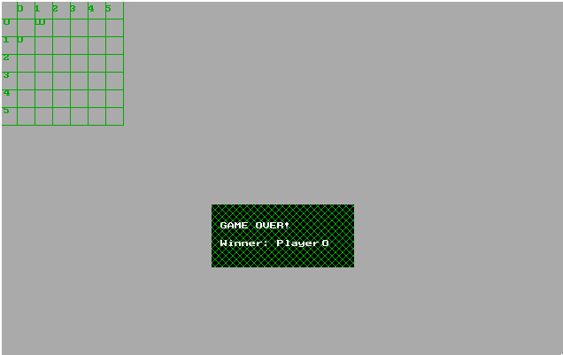

# ChainReaction
Chain Reaction game for DOS. [Hobby Project]

# Screenshots

# Compilation
Turbo C/C++ compiler is required to compile the program.

# Requirements to run binary directly (Not recommended)
* The *contents* of the *binary* folder should be directly extracted on the root of the file system. (i.e. C:\,D:\)

# Playing Instructions
The objective of Chain Reaction is to take control of the board by eliminating your opponents' bubbles.

Players take it in turns to place their bubbles in a cell. Once a cell has reached critical mass the bubbles explode into the surrounding cells adding an extra bubble and claiming the cell for the player. A player may only place their bubbles in a blank cell or a cell that contains bubbles of their own colour. As soon as a player looses all their bubbles they are out of the game.
 
Game features changing of number of columns of the grid which is currently supported only by changing the preferences at the compile time.
